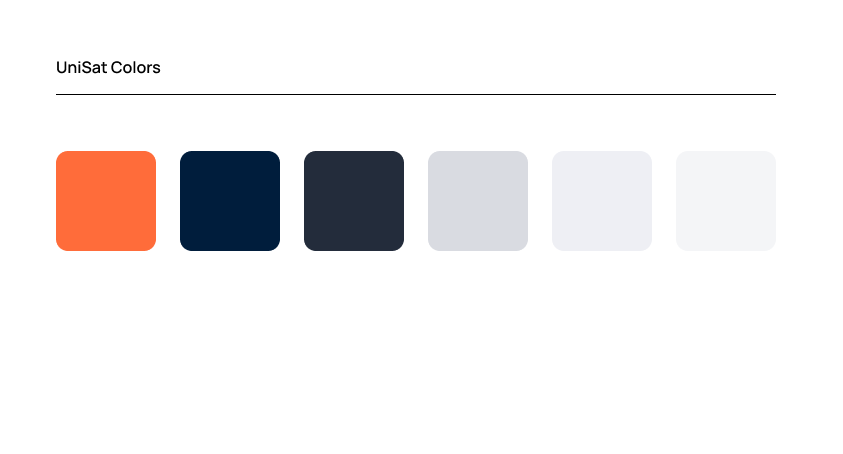
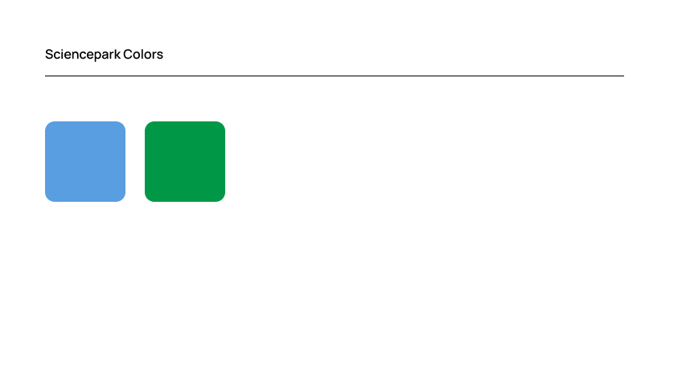
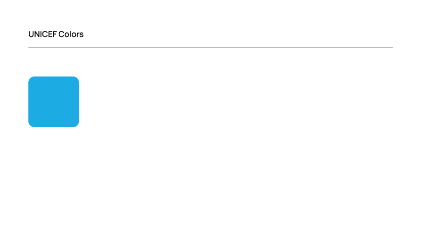
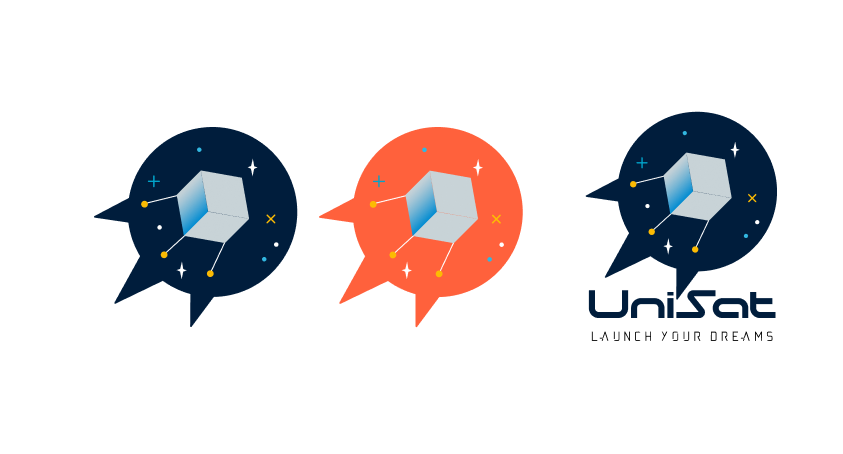
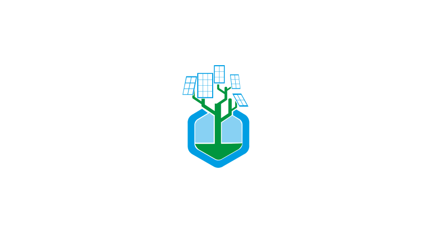
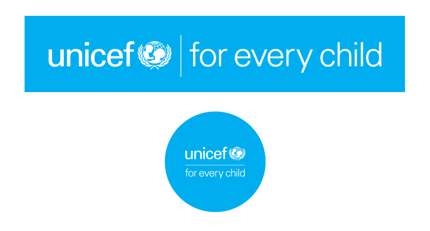
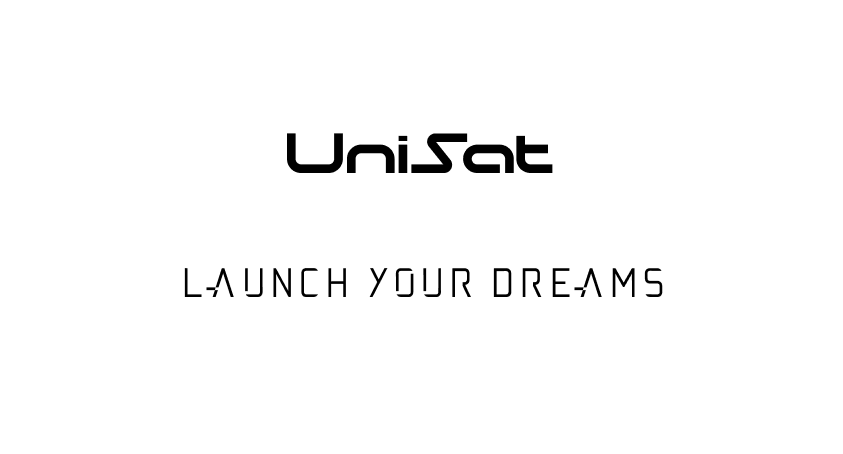

# web-ui

UNEPG Learning Platform web-ui design

## How to contribute?

This files uploaded here are created by Designer and Uploaded by @azataiot for
public audiences. you can download, use or modify them with agreement to
license. if you want to contribute to the project, please send an email to
either @azataiot (a@azat.ai) or the UniSat team (unisat@sciencepark.kz).

## styling and Colors

/style/ page includes styling information for UniSat, Sciencepark, and for
UNICEF

## Preview

- UniSat Orange : #FF6C3A
- UniSat Blue : #001D3C
- UniSat Dark : #232C3B

- Sciencepark Blue : #599EE0
- Sciencepark Green : #009847

- UNICEF Blue : #1CABE2

## Styling Advise for Social Media & Presentation

### Presentation

- Slide 16:9 — 1920 x 1080
- Slide 4:3 — 1024 x 768

### Social Media

- Twitter Post — 1012 x 506
- Twitter Header — 1500 x 500 
- Facebook Post — 1200 x 630 
- Facebook Cover — 820 x 312 
- Instagram Post — 1080 x 1080 
- Instagram Story — 1080 x 1920 
- LinkedIn Cover — 1584 x 396 

### 